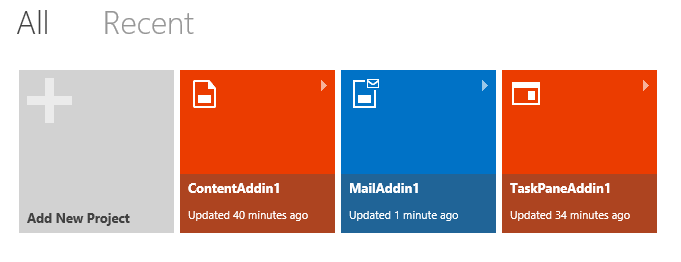
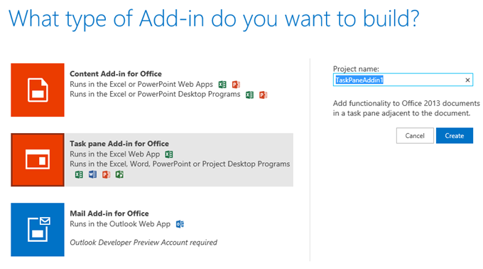

# Create a task pane add-in with Napa Office 365 Development Tools
Use Napa Office 365 Development Tools to create a task pane Office Add-in that shows a list of images. When users select text in the open document, a list of images that are tagged with the selected text are retrieved from Flickr and displayed in the task pane.

 _**Applies to:** apps for Office | Excel | Office Add-ins | PowerPoint | Project | Word_


You can also build a task pane add-in using [Visual Studio](http://msdn.microsoft.com/en-us/library/a23c5ce8-6de3-40f6-a86a-85d3592bef3e%28Office.15%29.aspx) or a [text editor](http://msdn.microsoft.com/en-us/library/d5411d35-9ef6-4e21-ba2b-4d2b1ee81359%28Office.15%29.aspx). If you're not sure which tool to use, see [Development basics](../overview/platform-overview.md#StartBuildingApps_DevelopmentBasics).


## Prerequisites
<a name="FirstAppWordExcelVS_Prerequisites"> </a>


- A [Microsoft account](http://www.microsoft.com/en-us/account/default.aspx)
    
- The URL for the [Napa Office 365 Development Tools](https://www.napacloudapp.com/ ) web app
    

## Create a basic Office Add-in
<a name="Create"> </a>


1. Open the [Napa Office 365 Development Tools](https://www.napacloudapp.com/ ) web app in your browser and sign in using your Microsoft account credentials.
    
2. Choose the  **Add New Project** tile.
    
    The  **Add New Project** tile appears only if you have created other projects. If this is your first project, skip to the next step.
    

    **New project tile**

    

3. Choose the  **Task pane Add-in for Office** tile, name the projectMyFirstTaskPaneAddin, and then choose the  **Create** button.
    
    **Task pane add-in tile**

    
    The code editor opens and shows the default webpage, which already contains some sample code that you can run without doing anything else.
    

### Run the sample Office Add-in


1. At the side of the page, choose the  **Run** button (
).
    
    Excel Online opens, and the sample Office Add-in appears in the task pane. You can experiment with its features by choosing  **Edit Workbook > Edit in Excel Online**.
    
2. When you are ready to move on, close Excel Online.
    

## Change the properties of the add-in
<a name="Change"> </a>


1. At the side of the page, choose the  **Properties** button (
) to display the Office Add-in properties.
    
2. Set the  **Name** property toMy First Task Pane Add-in and the **Description** property toThis app shows images that relate to text that's selected in the document.
    
    The  **Name** and **Description** properties help users understand the purpose of the add-in when it appears in a list of available add-ins for an Office application. The **Start Page** property points to the page that appears in the Office Add-in when you start the project. For this walkthrough, we'll use the default page that comes with your project, but you can add new pages to your project and set the **Start Page** property to any of those pages. For an example, see [Create a content add-in for Excel with Napa Office 365 Development Tools](../essentials/create-a-content-add-in-with-napa.md).
    
3. Choose the  **Apply** button at the bottom of the **Properties** page to save the property values.
    
    The  **Properties** editor shows the most common settings of an Office Add-in. It doesn't show all of the possible settings of an Office Add-in. If your scenario requires you to change settings that don't appear in the **Properties** editor, you can open your project in Visual Studio and edit the manifest file directly.
    
4. Choose the  **Explore** button (
) on the left side of the page to return to the project view.
    

## Capture the text that users select in a document
<a name="Get"> </a>


1. In Napa, choose  **Home.html**.
    
    The default webpage appears in the code editor.
    
2. Change the label for the  `get-data-from-selection` button to "Search Flickr", and add a `div` named `Images` in the `content-main` div. Here's the code.
    
  ```HTML
  <body>
    <!-- Page content -->
    <div id="content-header">
        <div class="padding">
            <h1>Welcome</h1>
        </div>
    </div>
    <div id="content-main">
        <div class="padding">
            <p><strong>Add home screen content here.</strong></p>
            <p>For example:</p>
            <button id="get-data-from-selection">Search Flickr</button>
            
            <p style="margin-top: 50px;">
                <a target="_blank" href="http://go.microsoft.com/fwlink/?LinkId=276812">
                    Find more samples online...
                </a>
            </p>
        </div>

        <!--This section renders the images-->
        <div>
            <div id="Images" style="height:800px; overflow:scroll"></div>
        </div>
    </div>
</body>


  ```

3. Choose  **Home.js**.
    
    The Home.js file appears in the code editor.
    
     **Note**  You can use the  `Office.initialize` method to define other actions that run when the add-in starts. If you want your code to access the Office object model, this function is the best place to put that code. If you add that code to the `Onload` event of the default HTML file, that event might be raised before the Office object model is initialized, and an error might occur.
4. In the Home.js file, change the  `getDataFromSelection` function by adding this line of code: `showImages(result.value);`
    
    Here's what your function looks like after you've added the code.
    


  ```
  function getDataFromSelection() {
        Office.context.document.getSelectedDataAsync(Office.CoercionType.Text,
            function (result) {
                if (result.status === Office.AsyncResultStatus.Succeeded) {
                    showImages(result.value);
               } else {
                    app.showNotification('Error:', result.error.message);
                }
            }
        );
    }
  ```


    This code gets the value of text that the user selects and calls a method to display images for the selected text. You'll define that method in the next procedure.
    
     **Note**  Like other methods in the JavaScript API for Office, this method is asynchronous in that it doesn't prevent the add-in from performing other operations while this method runs.

    The call to  `getSelectedDataAsync` passes an anonymous function with a parameter, named `result`, as the callback argument. When the callback function runs, it uses the  `result` parameter to access the value property of the `AsyncResult` object to display the data in the cell that the user chose.
    

## Show images in the task pane add-in by using the Flickr API
<a name="Show"> </a>


- In the Home.js file, add the following code. This code adds a function that shows images that relate to the selected text.
    
  ```
  function showImages(selectedText) {
    
    $('#Images').empty();

    var parameters = {
        tags: selectedText,
        tagsmode: "any",
        format: "json"
    };

    $.getJSON("https://secure.flickr.com/services/feeds/photos_public.gne?jsoncallback=?",
                    parameters,
                    function (results) {
                        $.each(results.items, function (index, item) {
                            $('#Images').append($("").attr("src", item.media.m));
                        });
                    }
    );
}
  ```


### Run it!


1. At the side of the page, choose the  **Run** button (
).
    
2. Excel Online opens, and the sample Office Add-in appears in the task pane. Choose  **Edit Workbook > Edit in Excel Online**.
    
3. Select a cell and type a keyword for an image search.
    
4. In the task pane, choose the  **Search Flickr** button.
    
    Images that are tagged with the selected word on Flickr appear in the task pane.
    
5. Close Excel Online.
    

## Debug your add-in in Internet Explorer
<a name="Debugging"> </a>

If you start your task pane add-in in Excel Online, and you use Internet Explorer (IE), you can use F12 developer tools to debug the JavaScript, HTML, and Cascading Style Sheets (CSS) of your add-in. 

Here's how to open F12 tools, start the debugger, and force execution to stop on a line of code in your Home.js file.


1. On the side of the page, choose the  **Run** button (
).
    
    Excel Online opens, and the Office Add-in appears. Choose  **Edit Workbook > Edit in Excel Online**.
    
2. Press the F12 key on your keyboard.
    
    The F12 tools open in a separate window.
    
3. In the F12 tools window, open the  **Debugger** tab.
    
4. Use the Ctrl-O keyboard shortcut to open a document, and then enter Home.js in the filter text box.
    
    The contents of the Home.js file appears in the window.
    
5. Set a breakpoint on the  `getDataFromSelection` method.
    
    For more information about how to set a breakpoint in the F12 tool window, see [Breaking Code Execution](http://go.microsoft.com/fwlink/?LinkID=267272).
    
6. In the add-in, enter a word in a cell, and then choose the  **Search Flickr** button.
    
    In the F12 tools window, execution stops on the  `getDataFromSelection` method.
    
    See [Using the F12 developer tools](http://msdn.microsoft.com/library/ie/bg182326%28v=vs.85%29) for more information.
    
    If you use a browser other than Internet Explorer, search your browser documentation.
    

## Next steps
<a name="Debugging"> </a>

Now that you've created a basic task pane add-in, you can:


- Share your project by choosing the  **Share Project** button (
). Napa creates a copy of your project and gives you a public link that you can share with anyone.
    
- Publish your add-in by choosing the  **Publish** button (
).
    
    See [Package your add-in using Napa or Visual Studio to prepare for publishing](../publish/package-your-add-in-using-napa-or-visual-studio.md).
    
- Create a content add-in for Excel by using Napa. Learn how to get information from a worksheet, put information into selected cells in a worksheet, and bind to cells in a worksheet. See [Create a content add-in for Excel with Napa Office 365 Development Tools](../essentials/create-a-content-add-in-with-napa.md). 
    
- Open your project in Visual Studio by choosing the  **Open in Visual Studio** button (
). Napa automatically installs the necessary tools and opens your project in Visual Studio.
    
- Create a task pane add-in for Excel or Word by using Visual Studio. See [Create a task pane or content add-in with Visual Studio](../essentials/create-a-task-pane-or-content-add-in-with-visual-studio.md).
    
- Learn more about Office Add-ins in the [Office Add-ins platform overview](../overview/platform-overview.md).
    

## Additional resources
<a name="FirstAppWordExcelVS_Resources"> </a>


- [Understanding the JavaScript API for Office](../overview/understanding-the-javascript-api-for-office.md)
    
- [Office Add-ins XML manifest](../overview/add-in-manifests.md)
    
