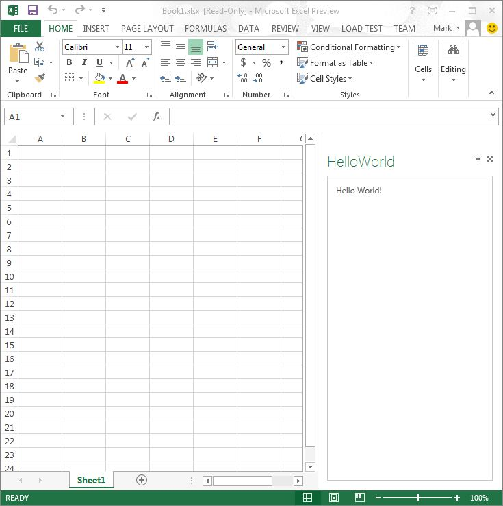
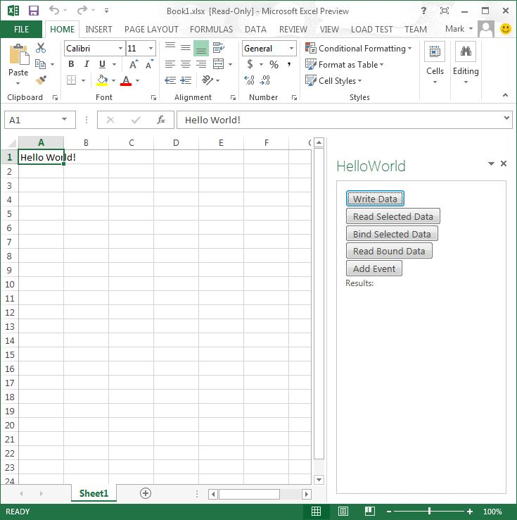
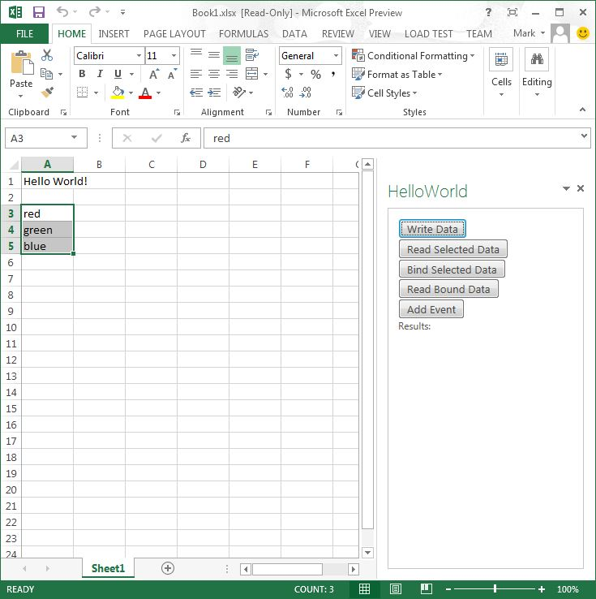
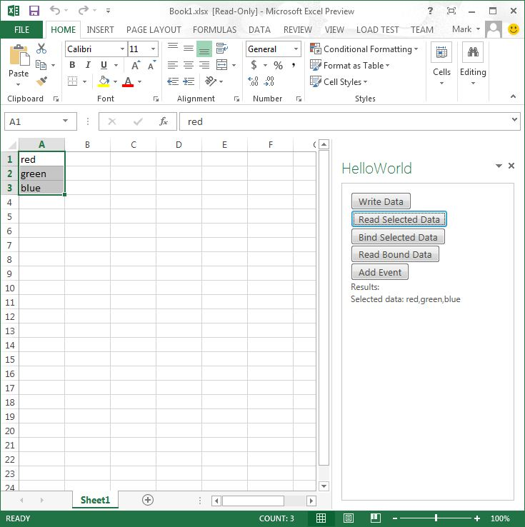
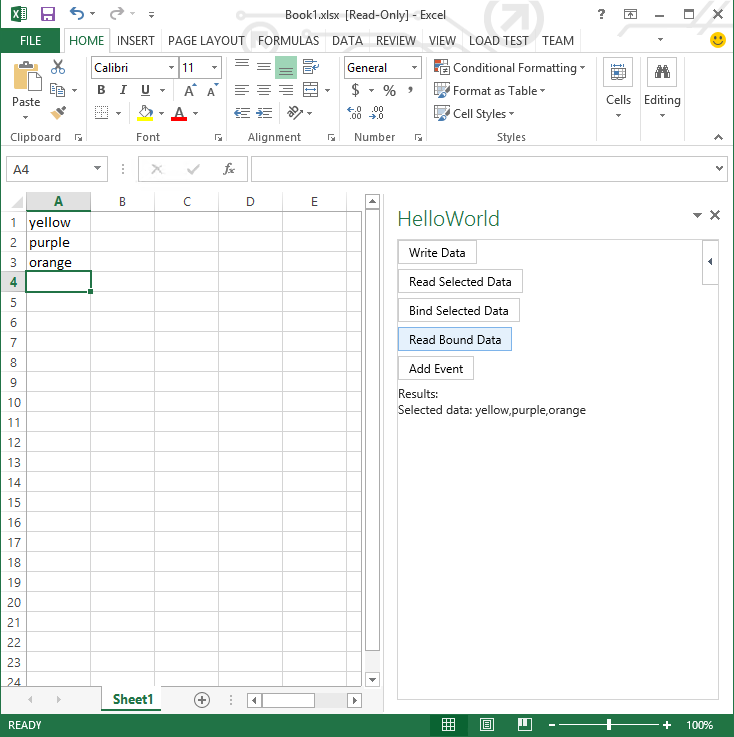
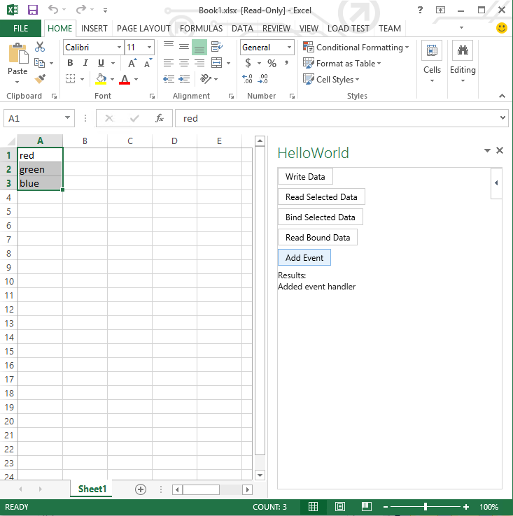
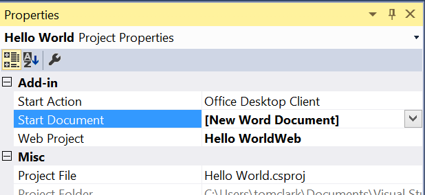
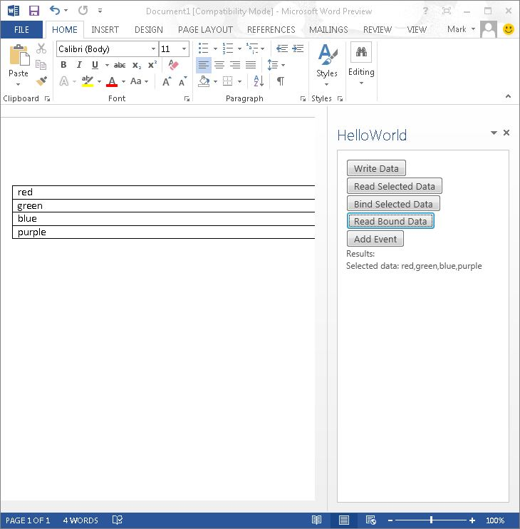
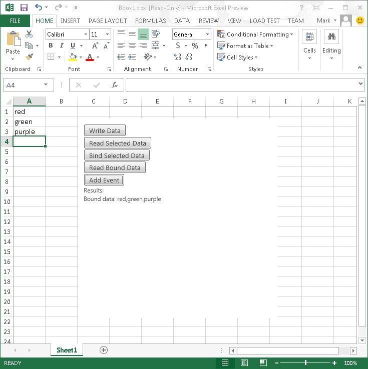

# Create a task pane or content add-in with Visual Studio
This article shows you how to use Visual Studio to create a Hello World Office Add-in and then extend it to read, write, and bind to the document.

 _**Applies to:** Access apps for SharePoint | apps for Office | Excel | Office Add-ins | PowerPoint | Project | Word_

The steps in this article describe how to create and run a simple  _Hello World_ task pane add-in in Excel. Then you'll extend the add-in to perform the following tasks:

- Write data to the current selection in the worksheet.
    
- Read data from the current selection in the worksheet and display it in the add-in UI.
    
- Create a binding to the current selection in the worksheet.
    
- Read the data in the binding and display it in the add-in UI.
    
- Add an event handler to read and display data whenever data in the binding is changed.
    
Finally, you'll make changes to some project settings and the manifest to do the following:

- Run the task pane add-in in Word.
    
- Run the add-in as a content add-in in Excel.
    

## Prerequisites


Install the following components before you get started:


- [Visual Studio 2015 and the latest Microsoft Office Developer Tools ](https://www.visualstudio.com/features/office-tools-vs). 
    
- Excel 2013 or later.
    
- Word 2013 or later.
    

## Create a project for the add-in


To get started, create an Office Add-ins project in Visual Studio. 


### To create a project in Visual Studio


1. On the Visual Studio menu bar, choose  **File**,  **New**,  **Project**.
    
    The  **New Project** dialog box opens.
    
2. In the list of project types under  **Visual C#** or **Visual Basic**, expand  **Office/SharePoint**, choose  **Office Add-ins**, and then choose  **Office Add-in**.
    
3. Name the project HelloWorld, and then choose  **OK**.
    
    The  **Create Add-in for Office** dialog box opens. In Visual Studio, the option **Task pane add-in** is selected. Choose the **Next** button, leave the check boxes for **Excel**,  **Word**,  **PowerPoint**, and  **Project** selected, and then choose **Finish**. 
    
    Visual Studio creates the project, and its files appear in  **Solution Explorer**. The default Home.html page opens in Visual Studio.
    

## Develop the add-in


To design the appearance of the add-in, you add HTML to the default page of the project. To design the functionality and programming logic for your add-in, you can add JavaScript code directly in the HTML page, but in this example, you'll add the code to the default JavaScript file (Home.js).


### To create a Hello World add-in


1. In the Home.html file, delete all of the tags between the opening and closing  `<body>` tags, and then type<div>Hello World!</div> inside the opening and closing **body** tags. The finished HTML should look like the following.
    
```HTML
  <!DOCTYPE html> 
<html> 
   <head> 
      <meta charset="UTF-8" /> 
      <meta http-equiv="X-UA-Compatible" content="IE=Edge" /> 
      <title></title>
 
      <script src="../../Scripts/jquery-1.9.1.js" type="text/javascript"></script> 
      <link href="../../Content/Office.css" rel="stylesheet" type="text/css" /> 
      <script src="https://appsforoffice.microsoft.com/lib/1/hosted/Office.js" type="text/javascript"></script>
 
      <!-- To enable offline debugging using a local reference to Office.js, use: --> 
      <!-- <script src="../../Scripts/Office/MicrosoftAjax.js" type="text/javascript"></script> --> 
      <!-- <script src="../../Scripts/Office/1.1/office.js" type="text/javascript"></script> -->
 
      <link href="../App.css" rel="stylesheet" type="text/css" /> 
      <script src="../App.js" type="text/javascript"></script> 
      <link href="Home.css" rel="stylesheet" type="text/css" /> 
      <script src="Home.js" type="text/javascript"></script> 
   </head>
 
   <body> 
      <div>Hello World!</div> 
   </body>
 
</html>
```

2. To get ready to deploy to IIS Express and debug in a local installation of Excel, confirm the configuration of the  **Start Action** property:
    
      1. In Solution Explorer, choose the HelloWorld add-in.
    
  2. In the  **Properties** window, make sure that the **Start Action** property is set to **Office Desktop Client**.
    
  3. Make sure that the  **Start Document** property is set to **[New Excel Workbook]**.
    
     >**Note**  If you were to choose  **Internet Explorer** or **Google Chrome** as the **Start Action** property, and then set **[New Excel Workbook]** as the **Start Document** property, Excel Online will start in the browser when you run the add-in.
3. On the  **Debug** menu, choose **Start Debugging** or press the F5 key.
    
     >**Note**  If this is the first time you've launched debugging in IIS Express (which is installed by Visual Studio), you'll prompted to trust and install the self-signed Localhost certificate used by IIS Express. Answer  **Yes** to both prompts to continue.

    Excel opens a blank workbook and add-in appears in the task pane.
    

    **Figure 1. Hello World task pane add-in**

    

4. Close the workbook file.
    
    Debugging stops and focus returns to Visual Studio.
    
In the following procedures, we'll extend your Hello World add-in to access data in the worksheet.


### To write data to the worksheet


1. Replace  `<div>Hello World!</div>` inside the opening and closing `<body>` tags of the HelloWorld.html page with the following HTML.
    
```HTML
  <button id="writeDataBtn"> Write Data </button> 
<button id="readDataBtn"> Read Selected Data </button> 
<button id="bindDataBtn"> Bind Selected Data </button> 
<button id="readBoundDataBtn"> Read Bound Data </button>
<button id="addEventBtn"> Add Event </button>

<span>Results: </span>
<div id="results"></div>
```


    This adds some buttons to perform data access actions and a  `div` to display results in the HTML page of the add-in. Next, we'll call the `writeData()` function to write sample text to the current selection.
    
2. Open the Home.js file to display the default JavaScript file for the add-in. If it's not already open, you can find it in  **Solution Explorer** under **Add-in**,  **Home**. 
    
3. Add an event handler  `$("#writeDataBtn").click` to the `$(document).ready` code to respond when a user clicks the **Write Data** button. The code should like the following.
    
```jsjs
  // The initialize function must be run each time a new page is loaded 
Office.initialize = function (reason) { 
   $(document).ready(function () { app.initialize();
 
       
      $("#writeDataBtn").click(function (event) { writeData(); 
      });
 
   }); 
};
```

4. Add the following functions to the Home.js file.
    
```js
  function writeData() { 
    Office.context.document.setSelectedDataAsync("Hello World!", function (asyncResult) { 
        if (asyncResult.status === "failed") { 
            writeToPage('Error: ' + asyncResult.error.message); 
        } 
    }); 
} 

function writeToPage(text) { 
    document.getElementById('results').innerText = text; 
}
```


     >**Note**  Do not to delete or overwrite the  `Office.initialize` event handler function (although you can replace the code within it). The `Office.initialize` event handler must be in place for your add-in to initialize correctly at runtime.

    The code in the  `writeData()` function calls the [Document.setSelectedDataAsync](http://msdn.microsoft.com/EN-US/library/fp142145.aspx) method to write "Hello World!" to the current cell when you choose the **Write Data** button. Most of the methods used in this walkthrough are asynchronous, which is why their names end with "Async", and callback functions like the anonymous function passed as the argument following "Hello World!" are used. For more information about using "Async" methods, see [Asynchronous programming in Office Add-ins](../how-to/asynchronous-programming-in-office-add-ins.md).
    
    The  `writeToPage(text)` function is a helper function for writing text back to the results `div` on the add-in HTML page. The `writeToPage(text)` function is also used to display data and messages in the code examples in the following procedures.
    
5. On the  **Debug** menu, choose **Start Debugging** or press the F5 key.
    
6. Choose the  **Write Data** button to write `"Hello World!"` to the current cell, but don't close the workbook or stop debugging yet.
    
    **Figure 2. Write text**

    

7. Switch back to the code editor, and replace  `"Hello World!"` in the call to the **setSelectedDataAsync** method with `[["red"],["green"],["blue"]]` like this.
    
```jsjs
  function writeData() { 
    Office.context.document.setSelectedDataAsync([["red"],["green"],["blue"]], function (asyncResult) { 
        if (asyncResult.status === "failed") { 
            writeToPage('Error: ' + asyncResult.error.message); 
        } 
    }); 
}
```


    Writing an array of arrays like  `[["red"],["green"],["blue"]]` creates what's called amatrix data structure, which in this case creates a single column of three cells (rows). You can create a matrix of two columns of three rows like this:
    
     ` [["red", "rojo"],["green", "verde"],["blue", "azul"]]`
    
    You can create a single row of three cells like this: 
    
     `[["red","green","blue"]]`
    
8. Choose Ctrl+S to save this change to the code.
    
9. Now switch back to the workbook, right-click in the add-in task pane, and then click  **Reload**.
    
    This reloads the HTML page with the updated JavaScript code.
    
10. Move the selection to a new cell, and then choose the  **Write Data** button.
    
    This writes the array containing  `red`,  `green`, and  `blue` to a single column of three cells.
    

    **Figure 3. Write matrix**

    

11. Close the workbook to stop debugging.
    

### To read data from the worksheet


1. In  **Solution Explorer**, open the Home.js file.
    
2. Add an event handler  `$("#readDataBtn").click` to the `$(document).ready` code to respond when a user clicks the **Read Selected Data** button. The code should like the following.
    
```js
  // The initialize function must be run each time a new page is loaded 
Office.initialize = function (reason) { 
    $(document).ready(function () { 
        app.initialize(); 
      
        $("#writeDataBtn").click(function (event) { 
            writeData(); 
        }); 
        $("#readDataBtn").click(function (event) { 
            readData(); 
        }); 
    }); 
};
```

3. Add the following code to the Home.js file below the functions you added in the previous procedure.
    
```jsjs
function readData() { 
    Office.context.document.getSelectedDataAsync("matrix", function (asyncResult) { 
        if (asyncResult.status === "failed") { 
            writeToPage('Error: ' + asyncResult.error.message); 
        } 
        else{ 
            writeToPage('Selected data: ' + asyncResult.value); 
        } 
    }); 
}
```


    The  `readData()` function calls the [Document.getSelectedDataAsync](http://msdn.microsoft.com/en-us/library/f85ad02c-64f0-4b73-87f6-7f521b3afd69%28Office.1501401%29) method to read the data that's currently selected by the user as a "matrix" _coercionType_, which is a 2-D array. For Excel, this will read a contiguous range of one or more cells.
    
4. On the  **Debug** menu, choose **Start Debugging** or press the F5 key.
    
5. Choose the  **Write Data** button, leave the three cells that have `red`,  `green`, and  `blue` in them selected, and then choose the **Read Selected Data** button.
    
    This reads the data from the three cells as a matrix data structure, and then writes those values to the add-in page.
    

    **Figure 4. Read matrix**

    

6. Close the workbook to stop debugging.
    

### To create a binding for selected data and read the bound data


1. In  **Solution Explorer**, open the Home.js file.
    
2. Add event handlers  `$("#bindDataBtn").click` and `$("#readBoundDataBtn").click` to the `$(document).ready` code to respond when a user clicks the **Bind Selected Data** and **Read Bound Data** buttons. The code should like the following.
    
```jsjs
  // The initialize function must be run each time a new page is loaded 
Office.initialize = function (reason) { 
    $(document).ready(function () { 
        app.initialize(); 
   
        $("#writeDataBtn").click(function (event) { 
            writeData(); 
        }); 
        $("#readDataBtn").click(function (event) { 
            readData(); 
        }); 
        $("#bindDataBtn").click(function (event) { 
            bindData(); 
        }); 
        $("#readBoundDataBtn").click(function (event) { 
            readBoundData(); 
        }); 
    }); 
};
```

3. Add the following code to the Home.js file below the function you added in the previous procedure. 
    
```jsjs
  function bindData() { 
    Office.context.document.bindings.addFromSelectionAsync("matrix", { id: 'myBinding' }, function (asyncResult) { 
        if (asyncResult.status === "failed") { 
            writeToPage('Error: ' + asyncResult.error.message); 
        } 
        else { 
            writeToPage('Added binding with type: ' + asyncResult.value.type + ' and id: ' + asyncResult.value.id); 
        } 
    }); 
}
```


    The  `bindData()` function calls the [Bindings.addFromSelectionAsync](http://msdn.microsoft.com/en-us/library/edc99214-e63e-43f2-9392-97ead42fc155%28Office.1501401%29) method to create a matrix binding with an [id](http://msdn.microsoft.com/en-us/library/94a0814d-70a0-4258-a837-2be04f68f068%28Office.1501401%29)of  `myBinding` that is associated with the cells that the user selected. You can specify the _bindingType_ as `"text"` to create a binding to a single cell in Excel, or to run of characters (a string) in a Word document. For more information about bindings, see [Bind to regions in a document or spreadsheet](../how-to/bind-to-regions-in-a-document-or-spreadsheet.md).
    
4. Add the following code to the Home.js file below the  `bindData ()` function.
    
```jsjs
  function readBoundData() { 
    Office.select("bindings#myBinding").getDataAsync({ coercionType: "matrix" }, function (asyncResult) { 
        if (asyncResult.status === "failed") { 
            writeToPage('Error: ' + asyncResult.error.message); 
        } 
        else { 
            writeToPage('Selected data: ' + asyncResult.value); 
        } 
    }); 
}
```


    The  `readBoundData()` function calls the [Office.select](http://msdn.microsoft.com/en-us/library/23aeb136-da1f-4127-a798-99dc27bc4dae%28Office.1501401%29) method to get the binding created by the `bindData()` function, which has an **id** of `myBinding`. (Alternatively, you can use the [Bindings.getByIdAsync](http://msdn.microsoft.com/en-us/library/2727c891-bc05-465c-9324-113fbfeb3fbb%28Office.1501401%29) method to access a binding by its **id**.) The function then calls the [Binding.getDataAsync](http://msdn.microsoft.com/en-us/library/5372ffd8-579d-4fcb-9e5b-e9a2128f3201%28Office.1501401%29) method to read the data from the binding. Because the binding is a matrix binding, you must specify the _coersionType_ as `"matrix"` for the call to succeed.
    
5. On the  **Debug** menu, choose **Start Debugging** or press the F5 key.
    
6. Choose the  **Write Data** button, leave three cells that have `red`,  `green`, and  `blue` in them selected, and then choose the **Bind Selected Data** button.
    
    This creates a matrix binding that is associated with the three selected cells that have the  **id** `myBinding`.
    

    **Figure 5. Create a binding**

    

7. Move the selection off of the three cells, and then choose the  **Read Bound Data** button.
    
    This will read the data from the binding created in the previous procedure, and then write those values to the add-in page. If you didn't change the values,  `red`,  `green`, and  `blue` will be displayed in the add-in.
    
8. Change one or more values in the three cells, press the Enter key after each change, and then choose  **Read Bound Data** again.
    
    This will read the changed data and display it in the add-in.
    

    **Figure 6. Read from binding**

    

9. Close the workbook to stop debugging.
    
Now let's add an event handler that will read and display the data in the binding whenever it is changed. 


### To add an event handler


1. Add an event handler  `$("#addEventBtn").click` to the `$(document).ready` code to respond when a user clicks the **Add Event** button. The code should like the following.
    
```jsjs
  // The initialize function must be run each time a new page is loaded 
Office.initialize = function (reason) { 
    $(document).ready(function () { 
        app.initialize(); 
     
        $("#writeDataBtn").click(function (event) { 
            writeData(); 
        }); 
        $("#readDataBtn").click(function (event) { 
            readData(); 
        }); 
        $("#bindDataBtn").click(function (event) { 
            bindData(); 
        }); 
        $("#readBoundDataBtn").click(function (event) { 
            readBoundData(); 
        }); 
        $("#addEventBtn").click(function (event) { 
            addEvent(); 
        }); 
    }); 
};
```

2. Add the following code to the Home.js file below the functions you added in the previous procedure.
    
```jsjs
  
function addEvent() { 
    Office.select("bindings#myBinding").addHandlerAsync("bindingDataChanged", myHandler, function (asyncResult) { 
        if (asyncResult.status === "failed") { 
            writeToPage('Error: ' + asyncResult.error.message); 
        } 
        else { 
            writeToPage('Added event handler'); 
        } 
    }); 
}
 
function myHandler(eventArgs) { 
    eventArgs.binding.getDataAsync({ coerciontype: "matrix" }, function (asyncResult) { 
        if (asyncResult.status === "failed") { 
            writeToPage('Error: ' + asyncResult.error.message); 
        } 
        else { 
            writeToPage('Bound data: ' + asyncResult.value); 
        } 
    }); 
}
```


    The  `addEvent()` function calls the **Office.select** method to get the `myBinding` binding object, and then calls the [Binding.addHandlerAsync](http://msdn.microsoft.com/en-us/library/b9c2f4ea-726c-4b48-a3fb-89beda337a17%28Office.1501401%29) method to add an event handler for the [Binding.bindingDataChanged](http://msdn.microsoft.com/en-us/library/7b9ed4bf-3ce5-44eb-8548-2b081afd868d%28Office.1501401%29) event. The `myHandler` function uses the [binding](http://msdn.microsoft.com/en-us/library/3f5adb74-0da6-46c6-a95e-0890bd935379%28Office.15%29.aspx) property of the [BindingDataChangedEventArgs](http://msdn.microsoft.com/en-us/library/d08e5556-20a6-469a-9c51-b0b95c8213ac%28Office.1501401%29) object to access the binding that raised the event, and then calls the **Binding.getDataAsync** method to read and display the data when the event occurs.
    
3. On the  **Debug** menu, choose **Start Debugging** or press the F5 key.
    
4. Choose the  **Write Data** button, leave three cells that have `red`,  `green`, and  `blue` in them selected, and then choose the **Bind Selected Data** button.
    
5. Choose the  **Add Event** button.
    
    This retrieves the binding with  **id** of `myBinding`, and then adds the  `myHandler` function as the handler for the **DataChanged** event.
    

    **Figure 7. Handling the DataChanged event**

    

6. Change one or more values in the three bound cells, and press the Enter key after each change.
    
    This will read the changed data and display it in the add-in task pane.
    
7. Close Excel to stop debugging.
    
In the next section we'll modify the add-in project so that you can run and test it in Word.


## Modify the add-in to run in Word


You can perform the following steps to modify this add-in project so that it will run and debug in Word 2013:


- Change the  **Start Document** property of the project to start Word when debugging.
    
- Run and debug in Word.
    

### To change the Start Document property in the Debugging property page of the project


1. In  **Solution Explorer**, choose the project name (HelloWorld). 
    
    The  **Project Properties** property page for the project appears in the pane below **Solution Explorer**.
    
2. Under  **Add-in**, in the  **Start Document** list, choose **[New Word Document]**.
    
    The  **Start Action** property is already set to **Office Desktop Client**, so all that's needed is to change the target document.
    

    **Figure 8. Setting the Start Document**

    


### To debug the add-in in Word


1. On the menu bar, choose  **Debug**,  **Start Debugging**.
    
    Word 2013 opens with the  **HelloWorld** add-in in the task pane.
    
2. Choose the  **Write Data**,  **Read Selected Data**,  **Bind Selected Data**,  **Read Bound Data**, and  **Add Event** buttons to perform the same actions as when working in Excel.
    
     >**Note**  In Word, the event handler won't run to display the bound data until you move the cursor outside of the table inserted by the  **Write Data** button.

    **Figure 9. Debugging in Word**

    


## Modify the add-in to run as a content add-in


You can perform the following steps to modify this add-in project so that it will run as a content add-in in Excel:


- Modify the manifest file to set the  **xsi:type** attribute to `"ContentApp"` in the [OfficeApp](http://msdn.microsoft.com/en-us/library/68f1cada-66f8-4341-45f5-14e0634c24fb%28Office.1501401%29) element.
    
- Modify the manifest file to set values for the [RequestedWidth](http://msdn.microsoft.com/en-us/library/29032529-6661-fb99-1ff3-c02cc474017f) and [RequestedHeight](http://msdn.microsoft.com/en-us/library/f573269b-7615-af82-2e0d-7e5661b66a20) elements.
    
- Modify the manifest file to remove the  `"Presentation"`,  `"Project"`, and  `"Document"` **Host** elements from the **Hosts** element.
    
- Change the  **Start Document** property of the project to start in Excel.
    

### To modify the manifest file


1. In  **Solution Explorer**, open the  `HelloWorld.xml` file.
    
2. In the opening  `OfficeApp` tag, change the value of the `xsi:type` attribute to `"ContentApp"`.
    
```XML
  <OfficeApp xmlns="http://schemas.microsoft.com/office/appforoffice/1.1" 
          xmlns:xsi="http://www.w3.org/2001/XMLSchema-instance" 
          xsi:type="ContentApp">
```


    The  **xsi:type** attribute specifies the type of Office Add-in, which determines how the add-in runs when the user inserts it into a document or workbook. The previous value, `"TaskPaneApp"`, specifies that the add-in runs in a task pane. Changing  **xsi:type** to `"ContentApp"` specifies that the add-in runs in line with the workbook content as a content add-in.
    
     >**Note**  In this release of Office, content add-ins can run only in the [client applications that support content add-ins](../overview/platform-overview.md#StartBuildingApps_SupportedApplications). After you change  **xsi:type** to `"ContentApp"` in the manifest, this add-in will run only in Access web apps, Excel, or PowerPoint.
3. Add the following  **RequestedWidth** and **RequestedHeight** elements in the manifest within the `<DefaultSettings>` tags.
    
```XML
  <DefaultSettings> 
    <SourceLocation DefaultValue="~remoteAppUrl/App/Home/Home.html" /> 
    <RequestedWidth>200</RequestedWidth> 
    <RequestedHeight>200</RequestedHeight> 
</DefaultSettings>
```

4. Remove the  `"Presentation"`,  `"Project"`, and  `"Document"` **Host** elements from the **Hosts** element, so that only the `"Workbook"` **Host** element remains.
    
```XML
  <Hosts> 
    <Host Name="Workbook" /> 
</Hosts>
```

5. Save these changes to the HelloWorld.xml file.
    

### To change the Start Document property in the property page of the project


1. In  **Solution Explorer**, choose the project name (HelloWorld). 
    
    In the  **Properties** pane (below the **Solution Explorer** pane), the property page for the project appears.
    
2. Under  **Add-in**, set  **Start Document** to **[New Excel Workbook]**.
    

### To debug the add-in in Excel


1. On the menu bar, choose  **Debug**,  **Start Debugging**.
    
    Excel 2013 opens with the  **HelloWorld** add-in running as a content add-in in the worksheet.
    
2. Choose the  **Write Data**,  **Read Selected Data**,  **Bind Selected Data**,  **Read Bound Data**, and  **Add Event** buttons to perform the same actions as before.
    
    **Figure 10. Debugging as a content add-in**

    


## Next steps


To learn more about developing Office Add-ins, see the following:


- [Design guidelines for Office Add-ins](../design/add-in-design.md)
    
- [Office Add-ins development lifecycle](../design/add-in-development-lifecycle.md)
    
- [Publish your Office Add-in](../publish/publish.md)
    
- [Package your add-in using Napa or Visual Studio to prepare for publishing](../publish/package-your-add-in-using-napa-or-visual-studio.md)
    

 >**Tip**  To deploy and publish an add-in from Visual Studio, see [Package your add-in using Napa or Visual Studio to prepare for publishing](../publish/package-your-add-in-using-napa-or-visual-studio.md). To publish an add-in without using Visual Studio, you can deploy the HTML page for your add-in and .js files on a web server, and then upload your add-in manifest file to a [network share catalog](../publish/create-a-network-shared-folder-catalog-for-task-pane-and-content-add-ins.md) or [Add-in Catalog on SharePoint](../publish/publish-task-pane-and-content-add-ins-to-an-add-in-catalog.md). Before uploading the manifest file, replace the  `~remoteAppUrl` token in the `DefaultValue` attribute of `SourceLocation` tag to specify the full URL of the default HTML page for your add-in on the web server where it is hosted.


## Additional resources


- [Task pane and content add-ins for Office 2013](../essentials/task-pane-and-content-add-ins.md)
    
- [Understanding the JavaScript API for Office](../overview/understanding-the-javascript-api-for-office.md)
    
- [Office Add-ins XML manifest](../overview/add-in-manifests.md)
    
