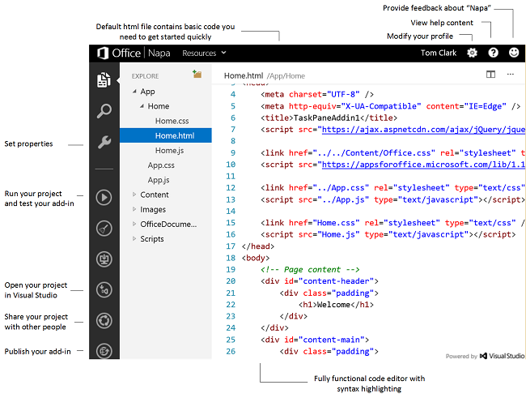

# Create Office Add-ins with Napa with an Office 365 Developer Site
Use Napa Office 365 Development Tools with an Office 365 Developer Site to create Office and SharePoint Add-ins.

 _**Applies to:** apps for Office | Office 365 | Office Add-ins_

Napa is a great way to get started building Office Add-ins right in a browser window. You don't need to install any tools such as Visual Studio. All you need is an Office 365 account and a supported browser. To get started, sign up for an Office 365 Developer Site. Then, install Napa on your Developer site and you are ready to create Office Add-ins. See [Set up a development environment for SharePoint Add-ins on Office 365](http://msdn.microsoft.com/library/b22ce52a-ae9e-4831-9b68-c9210af6dc54%28Office.15%29.aspx). When you're ready to use the powerful capabilities in Visual Studio, Napa makes it easy to download your project and continue developing your Office Add-in.

 **Note**  There's an alternate version of Napa that doesn't use or require an Office 365 Developer Site. That version supports creating only Office Add-ins using your personal [Microsoft account](http://www.microsoft.com/en-us/account/default.aspx). 

## Create and manage projects

Napa gives you a page to manage your projects. You can use this page to create a mail add-in, content add-in, or task pane add-in project, rename, and delete projects. You can also open any project in Visual Studio if you decide that you want to use features such as advanced debugging or use a web project as part of your Office Add-in. Choose a filter to view recently modified projects or projects of a specific type. Choose a project tile if you want to open an existing project. 

## Develop add-ins

When you open a project, a default HTML file appears in a code editor. This file contains all the file references that you need to get started. Use the productivity features of the editor such as syntax highlighting and code completion to write your code. You can access many of these features by using shortcut key combinations. To view a list of shortcut key combinations, press CTRL and the "." key simultaneously. Files of your project appear in a hierarchical view to the side of the editor. Use the context menus of files and folders in this view to add, rename, or upload files (for example, HTML, JavaScript or style sheets). Use the options at the bottom of the page to run your project, modify the properties of the add-in, or open your project in Visual Studio. 

**Code editor**

## Share and publish add-ins

While you're developing your add-in, if you want to share it with someone else, such as to show them code or pages you're developing, you can use the Share Project feature. To share an add-in project, load the project in Napa and then choose the  **Share Project** button on the side of the page. The Share Project feature creates a copy of the add-in project and provides you with a public link that you can give to anyone to enable them to view the copy of the add-in project. After you've completed your add-in project and want to distribute it, you can publish your add-in. See [Publish SharePoint Add-ins](http://msdn.microsoft.com/library/f5a92b98-5520-4bba-9131-b56d2a21a321%28Office.15%29.aspx) or [Package your add-in using Napa or Visual Studio to prepare for publishing](../publish/package-your-add-in-using-napa-or-visual-studio.md).

## Next steps

To create your first Office Add-in, see the following:

- [Create a mail add-in for Outlook with Napa Office 365 Development Tools](http://msdn.microsoft.com/library/aca047c7-5afa-4511-9cac-e22ce9c3bcd7%28Office.15%29.aspx)
    
- [Create a content add-in for Excel with Napa Office 365 Development Tools](../essentials/create-a-content-add-in-with-napa.md)
    
- [How to: Create your first task pane add-in by using "Napa" Office 365 Development Tools](https://dev.outlook.com/MailAppsGettingStarted/GetStarted.aspx)
    
