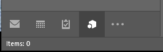
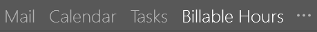
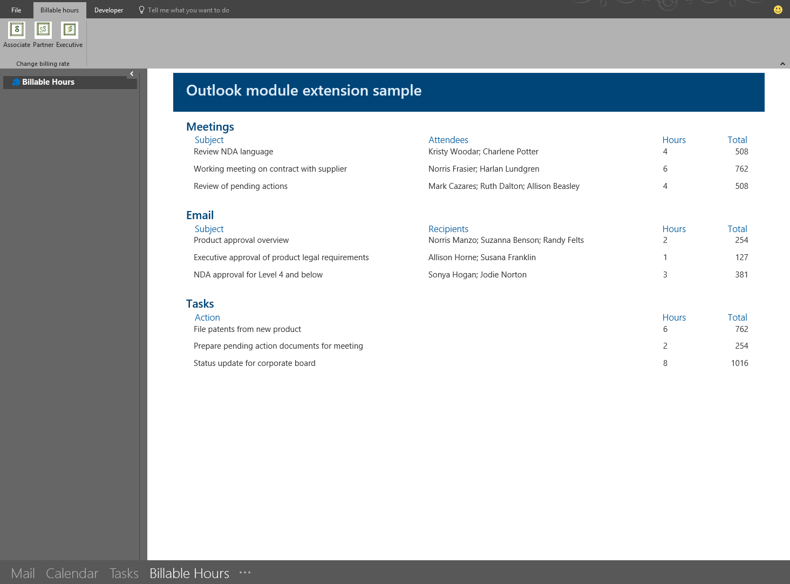

#Module extension Outlook add-ins
Integrate your Outlook add-in with Outlook's navigation bar

Module extension add-ins appear in the Outlook navigation bar, right alongside mail, tasks,
and calendars. A module extension is not limited to using mail and appointment information;
you can create applications that run inside Outlook to make it easy for your users
to access business information and productivity tools without ever leaving Outlook.

To open a module extension, users click on the module's name or icon in the Outlook 
navigation bar. If the user has compact navigation selected, the navigation bar has an
icon that shows an extension is loaded.

If the user is not using compact navigation, the navigation bar has two looks; with one
extension loaded it shows the name of the add-in.

When more than one add-in is loaded it shows the word "Add-ins". Clicking either will 
open the extension's user interface.

When you click on an extension, Outlook replaces the built-in module with you custom module
so that your users can interact with the add-in. You can use all of the features of the 
Outlook JavaScript API in your add-in, and can create command buttons in the Outlook ribbon
that will interact with the add-in content. This sample add-in is integrated in the Outlook
navigation bar and has ribbon commands that will update the content of the add-in.

