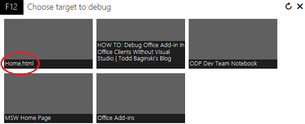
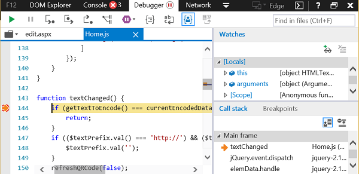

# Debug add-ins using F12 developer tools on Windows 10
Use the Debugger from the F12 developer tools on Windows 10 to debug Office add-ins.

 _**Applies to:** apps for Office | Office Add-ins_

The F12 developer tools help you debug, test, and speed up your webpages. They can also be used with Office add-ins. The F12 tools are available with Windows 10. 
The F12 developer tools can help develop and debug your Office add-in if you are not using an IDE like Visual Studio or if you need to investigate a problem while running your add-in outside the IDE. The F12 developer tools can be started after your add-in is running.
This article shows how you can use the Debugger tool from the F12 developer tools in Windows 10 to test your Office add-in. You can test add-ins from the Store and also any add-ins in your account. The F12 tools display in their own window and do not use Visual Studio.

 **Note**  The Debugger is part of the F12 developer tools on Windows 10 and Internet Explorer. It is not in earlier versions of Windows. 

### Prerequisites

You need the following software:

- The F12 developer tools, which is part of Windows 10. 
    
- The Office client application that hosts your add-in. 
    
- Your add-in. 
    
This example uses Word and a free add-in from the Office Store.

### Using the Debugger

1. Open the Office client application on your computer. 
    
    Open Word and choose a blank document. 
    
2. On the  **Insert** tab in the Ribbon, choose the **My Add-ins** button and load an Add-in from the Store or your Add-in Catalog.
    
    For this example, choose the Store button and select the QR4Office add-in.
    
3. Launch the F12 development tools that corresponds to your version of Office:
    
      - For the 32-Bit version of Office, use C:\Windows\System32\F12\F12Chooser.exe
    
  - For the 64-Bit version of Office, use C:\Windows\SysWOW64\F12\F12Chooser.exe
    

    When you launch F12Chooser, a separate window (titled "Choose target to debug") displays the possible applications to debug. Select the application that you are interested in. If you are writing your own add-in, select the website where you have the add-in deployed, which could be a localhost URL. 
    
    For example, select  **home.html**. 
    
    

4. In the F12 window, select the file you want to debug.
    
    To select the file, choose he folder icon above the  **script** (left) pane. The dropdown list shows the available files. Select home.js.
    
5. Set the breakpoint.
    
    To set the breakpoint in home.js, choose line 144, which is in the  _textChanged_ function. You will see a red dot to the left of the line and a corresponding line in the **Callstack and Breakpoints** (bottom right) pane. For other ways to set a breakpoint, see[Inspect running JavaScript with the Debugger](https://msdn.microsoft.com/library/dn255007%28v=vs.85%29.aspx). 
    
    

6. Run your add-in to trigger the breakpoint.
    
    Choose the URL textbox in the upper part of the QR4Office pane to change the text. In the Debugger, in the  **Callstack and Breakpoints** pane, you'll see that the breakpoint has triggered and shows various information. You might need to refresh the F12 tool to see the results.
    
    

## Additional resources

- [Inspect running JavaScript with the Debugger](https://msdn.microsoft.com/library/dn255007%28v=vs.85%29.aspx)
    
- [Using the F12 developer tools](https://msdn.microsoft.com/en-us/library/bg182326%28v=vs.85%29.aspx)
    
